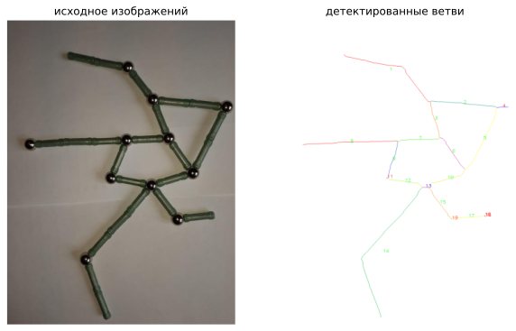

# Обработка и распознавание изображений

Лабораторная работа №2. Изучение и освоение методов классификации формы изображений.

Выполнил: Алексеев Илья Алексеевич, 317 группа.

## Постановка задачи

Дано:

- фотографии графов, построенных из магнитной головоломки

- все графы делятся на четыре класса, соответствующие классам изоморфизма графов ([подробнее](https://en.wikipedia.org/wiki/Graph_isomorphism))

- фотографии имеют размер $1024\times768$ и качество $72$ dpi


Найти:

- класс графа по фотографии

- сколько вершин разных степеней ([подробнее](https://en.wikipedia.org/wiki/Degree_(graph_theory)))

## Решение

### Алгоритм действий

- Сегментация графа и построение скелета формы
    1. Удаление теней ([источник](https://stackoverflow.com/a/44752405)). Для каждого RGB-канала в отдельности:
       1. [Дилатация](https://docs.opencv.org/3.4/d4/d86/group__imgproc__filter.html#ga4ff0f3318642c4f469d0e11f242f3b6c)
       2. [Медианное размытие](https://docs.opencv.org/3.4/d4/d86/group__imgproc__filter.html#ga564869aa33e58769b4469101aac458f9)
       3. [Нормализация](https://docs.opencv.org/3.4/d2/de8/group__core__array.html#ga87eef7ee3970f86906d69a92cbf064bd)
    2. Бинаризация:
       1. [Размытие Гаусса](https://docs.opencv.org/3.4/d4/d86/group__imgproc__filter.html#gaabe8c836e97159a9193fb0b11ac52cf1)
       2. Пороговое отсечение [методом Отсу](https://en.wikipedia.org/wiki/Otsu%27s_method)
       3. [Дилатация](https://docs.opencv.org/3.4/d4/d86/group__imgproc__filter.html#ga4ff0f3318642c4f469d0e11f242f3b6c)
       4. [Эрозия](https://docs.opencv.org/3.4/d4/d86/group__imgproc__filter.html#gaeb1e0c1033e3f6b891a25d0511362aeb)
    3. Построение скелета изображения (средствами пакета [`skimage.morphology`](https://scikit-image.org/docs/stable/api/skimage.morphology.html#skimage.morphology.skeletonize))
- Анализ скелета
  1. Поиск всех ветвей скелета и их пересечений (средствами пакета [`skan.csr`](https://skeleton-analysis.org/stable/api/skan.csr.html))
  2. Найденные ветви объявляем рёбрами графа, пересечения — вершинами графа
  3. Классификация найденных рёбер графа на обычные, промежуточные и мусорные
     - подробнее в разделе “Поиск ветвей и пересечений. Классификация рёбер”
  4. Подсчёт степеней вершин на основе того, какой тип у примыкающих рёбер 
     - Подробнее в разделе “Подсчет степеней вершин”

Все функции, связанные с сегментацией и анализом скелета, реализованы в файлах `segmentation.py` и `skeleton.py`. Примеры работы с этими функциями представлены в ноутбуках `segmentation.ipynb` и `skeleton.ipynb`.

### Удаление теней

Демонстрация:


Данный шаг значительно улучшает качество сегментации:


### Построение скелета


### Поиск ветвей и пересечений. Классификация ветвей

Поиск ветвей и пересечений производится полностью средствами [`skan.csr.Skeleton`](https://skeleton-analysis.org/stable/api/skan.csr.html#skan.csr.Skeleton). Изобразим найденные ветви скелета:


Заметим, что не все ветви соответветствуют рёбрам графа. А именно присутствуют короткие ветви, возникшие на месте

- выступавших шариков (ветви с красными номерами)

- шариков с более чем тремя примыкающими рёбрами (одна ветвь с синим номером, номер 15)

Введём несколько определений:

1. *Пиксельное расстояние между соседними пикселями* будем считать

    - равным $1$, если пиксели являются соседними по вертикали или горизонтали

    - равным $\sqrt2$, если пиксели являются соседними по диагонали

2. *Пиксельной длиной ветви скелета* будем называть сумму пиксельных расстояний между пикселями данной ветви.

3. *Степенью пикселя* назовём число соседних с ним пикселей (и по диагонали, и по горизонтали)

Все ветви скелета делятся на три вида:

- обычные (зеленые номера на рисунке) — пиксельная длина ветви больше некоторого порога
- промежуточные (синие номера на рисунке) — пиксельная длина ветви меньше некоторого порога и концевые пиксели имеют степени больше 1
- мусорные (красные номера на рисунке) — пиксельная длина ветви меньше некоторого порога и хотя бы один из концевых пикселей имеет степень 1

### Подсчёт степеней вершин

Заметим, что

- если к данному пикселю примыкают только обычные ветви скелета, то степень соответствующей вершины равна степени данного пикселя
- примыкающие мусорные ветви не дают вклад в степень вершины
- примыкающие промежуточные ветви вносят вклад в степень вершины, равный сумме степеней вершин связного подграфа из промежуточных ветвей

Эти замечания выливаются в алгоритм подсчета степеней вершин:

- сначала для каждой вершины
    - запоминаем число обычных рёбер, примыкающих к данной вершине
- затем для каждой вершины
    - если среди примыкающих ребёр есть промежуточные, то
        - посчитать сумму ранее посчитанных степеней всех вершин связного подграфа из промежуточных путей
    - слить все вершины данного подграфа в одну

Простота программной реализации во многом была достигнута благодаря объекто-ориентированному программированию: использованы сущности `Node` и `Edge` с интерфейсами для обновления примыкающих путей. Сумма степеней в подграфах вычисляется с помощью обхода в глубину.

### Улучшение детектирования ветвей

 Рассмотрим пример:



В данном случае ветвь 1 на самом деле является двумя рёбрами, соединёнными вершиной степени 2 (поскольку на исходном изображении они были разделены шариком). Как и ветвь 14.

Чтобы исправить это, была предложена следующая модификация:

- на скелет формы добавить “засечки” в те места, где два ребра соединены вершиной степени 2

- такие места можно найти с помощью детектирования окружностей на исходном изображении

  1. Перевод цветного изображения в полутоновое

  2. [Размытие Гаусса](https://docs.opencv.org/3.4/d4/d86/group__imgproc__filter.html#gaabe8c836e97159a9193fb0b11ac52cf1)

  3. Детекция окружностей с помощью [алгоритма Хаффа](https://docs.opencv.org/4.x/dd/d1a/group__imgproc__feature.html#ga47849c3be0d0406ad3ca45db65a25d2d)

- “засечка” — это отрезок, пересекающий ветвь скелета
  - угол, под которым отрезок пересекает ветвь выбирается случайно из равномерного распределения на отрезке $[0,180]$
  - такой выбор угла не гарантирует, что отрезок не будет сливаться с ветвью

Результат работы алгоритма Хаффа:


Демонстрация засечек:


Такая модификация не всегда решает проблему и, более того, может “испортить” другие вершины. Решить такой нюанс можно, например, следующим образом: запустить алгоритм $k$ раз и провести голосование между всеми результатами. Этот алгоритм используется далее для проверки.

## Тест

Тест проводился на выборке из восьми изображений (папка `images`). 

Пример результатов работы:

```
2:	[3, 4, 3, 3]	[3, 4, 3, 3]	[3, 4, 3, 3]	[3, 4, 3, 3]	[3, 4, 3, 3]
13:	[3, 4, 2, 4]	[3, 4, 3, 3]	[3, 4, 3, 3]	[3, 4, 3, 3]	[3, 4, 3, 3]
3:	[4, 5, 4, 1]	[4, 5, 4, 1]	[4, 5, 4, 1]	[4, 5, 4, 1]	[4, 5, 4, 1]
25:	[4, 5, 4, 1]	[4, 5, 4, 1]	[5, 5, 4, 1]	[6, 4, 5, 1]	[4, 5, 4, 1]
4:	[3, 4, 5, 2, 1]	[4, 3, 5, 2, 1]	[4, 3, 5, 2, 1]	[4, 3, 5, 2, 1]	[4, 3, 5, 2, 1]
19:	[4, 3, 5, 2, 1]	[6, 3, 5, 2, 1]	[3, 4, 5, 2, 1]	[4, 3, 5, 2, 1]	[5, 4, 5, 2, 1]
5:	[6, 3, 4, 2]	[6, 3, 4, 2]	[6, 3, 4, 2]	[6, 3, 4, 2]	[6, 3, 4, 2]
7:	[6, 3, 4, 2]	[6, 3, 4, 2]	[6, 3, 4, 2]	[6, 3, 4, 2]	[6, 3, 4, 2]
```

Ответы:


 

Видим, что все фотографии снабдены правильными описаниями. Отображение таких описаний на множество меток классов — задача тривиальная.

## Итоги

Самые сложные части решения — это построение скелета и поиск в нем ветвей — реализованы в пакетах `skimage.morphology` и `skan.csr`. Самая трудоёмкая часть решения — обход всего скелета для подсчёта степеней вершин. Также значительная доля результата не была бы получена без модификации с засечками и голосованием. По итогу получилось реализовать генерацию корректного признакового описания фотографии графа.