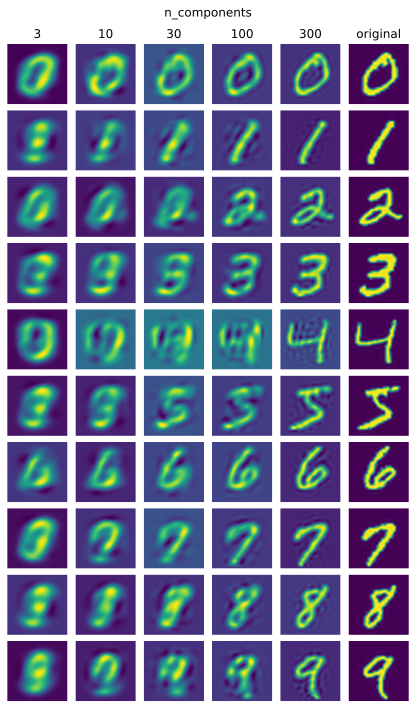
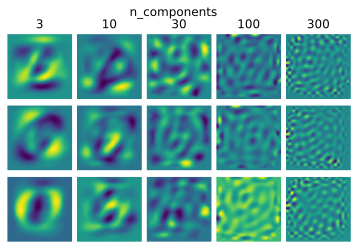

# Derivation of PCA

## Demo

Quality degradation with PCA:

Three principal components visualized:

Code for these images is in `testbed.ipynb`.

## Derivation

Let $X=\{x_1,\ldots,x_\ell\}\in\R^{\ell\times d}$ be $\ell$ samples from $d$-dimensional space. PCA can be derived from the idea of **lossy compression**. 

Let $m<d$ and
- $f:\R^d\to\R^m$ be encoding function,
- $g:\R^m\to\R^d$ be decoding function.

*Goal: find such $f,g$, that $x\approx g(f(x))$ in average for samples $X$.* To be exact, the approximate equality means following:
$$
f^*(x)=\arg\min_f\|x-g(f(x))\|_2^2.
$$
Let $f(x)=c$ (constant). Let's transform the minimized functional (including discarding terms independent of $c$):
$$
c^*=\arg\min_c-2x^Tg(c)+g(c)^Tg(c).
$$
PCA uses $g(c)=Dc$ for simplicity, where $D\in\R^{d\times m}$ and $D^TD=I$. This gives the following:
$$
c^*=D^Tx.
$$
Thus, $f(x)=D^Tx$ and $g(f(x))=DD^Tx$. This means the following:
$$
D^*=\arg\min_D\|X-XDD^T\|_F^2.
$$
Let's transform the minimized functional (including discarding terms independent of $c$):
$$
\|X-XDD^T\|_F^2\stackrel{\text{def}}{=}\text{tr}(X^T-DD^TX^T)(X-XDD^T)=\\
\text{tr}(X^TX-X^TXDD^T-DD^TX^TX+DD^TX^TXDD^T)\stackrel{\text{discard }X^TX}{\sim}\\
\sim-\text{tr}(X^TXDD^T)-\text{tr}(DD^TX^TX)+\text{tr}(DD^TX^TXDD^T)\stackrel{\text{cycle}}{=}\\
-2\text{tr}(X^TXDD^T)+\text{tr}(X^TXDD^TDD^T)\stackrel{D^TD=I}{=}-\text{tr}(X^TXDD^T)\stackrel{\text{cycle}}{=}\\
=-\text{tr}(D^TX^TXD)\stackrel{\text{def}}{=}-\langle XD,XD\rangle\stackrel{\text{def}}{=}-\|XD\|_F^2.
$$
Got convex optimization problem:
$$
\begin{array}{}
\max_D\ \|XD\|_F^2,\\
\text{s.t.}\ D^TD=I.
\end{array}\quad\iff\quad
\begin{array}{}
\min_D\ -\sum\limits_{i=1}^\ell\sum\limits_{j=1}^m(x_i^Td_j)^2,\\
\text{s.t.}\ d_p^Td_q=[p=q],\ i,j=\overline{1,m}.
\end{array}
$$
Lagrangian:
$$
L(d_1,\ldots,d_m,\Lambda)=-\sum\limits_{i=1}^\ell\sum\limits_{j=1}^m(x_i^Td_j)^2+\sum_{p=1}^m\sum_{q=1}^m\lambda_{ij}(d_p^Td_q-[p=q]).
$$
Optimality conditions:
$$
\begin{align*}
& \lambda_{pq}\geqslant 0,\quad p,q=\overline{1,m},\\
& d_p^Td_q=[p=q],\quad p,q=\overline{1,m},\\
& L'_{d_k}=-2\sum_{i=1}^\ell(x_i^Td_k)x_i+2\lambda_{kk}d_k+\sum_{\substack{q=1 \\ q\neq k}}^M\lambda_{kq}d_q=0,\quad k=\overline{1,m}.
\end{align*}
$$
Last condition can be transformed into this:
$$
L'_{d_k}=2(I\lambda_{kk}-X^TX)d_k+\sum_{\substack{q=1 \\ q\neq k}}^m \lambda_{kq}d_q=0,\quad k=\overline{1,m}.
$$

Now, let's respite and analyze. Note, that these conditions are satisfied by the following $D$:

- max eigen vectors $d_1,\ldots,d_m$ of $X^TX$ (right singular vectors of $X$)
- corresponding eigen values $\lambda_{11},\ldots,\lambda_{mm}$ (singular values of $X$)
- the rest of dual variables are zero: $\lambda_{pq}=0,\ p\neq q$
- $X^TX\succcurlyeq0\Rightarrow\lambda_{ii}\geqslant0$.

Due to convexity of the problem, this is the only solution. 

## Interpretation

Obtained result can be interpreted in the following ways:

- as the low-rank approximation theorem
- the theorem on the diagonalization of the covariance matrix $X^TX=D\Lambda D^T$
- a method for extracting the **principal components**, i.e. singular vectors corresponding to maximum singular numbers (i.e. directions with maximum variance)

## PCA Algorithm

Fitting to $X$:

1. Standardize each sample:

$$
\bar x_{ij}=(x_{ij} - \mu_j) / \sigma_j,\quad \mu_j={1\over \ell}\sum_{i=1}^\ell x_{ij},\quad\sigma_j={1\over\ell-1}\sum_{i=1}^\ell(x_{ij}-\mu_j)^2.
$$

2. Compute covariance matrix:

$$
C_X={1\over\ell-1}\bar X^T\bar X.
$$

3. Find top $m$ eigen vectors of covariance matrix: $d_1,\ldots,d_m\Rightarrow D\in\mathbb{R}^{d\times m}$.

Encoding $x$:

1. Standardize each sample using pre-computed mean and std: $\bar x=(x-\mu)/\sigma$.
2. Project to basis of eigen vectors: $f(\bar x)=D^T\bar x$.

Decoding $\hat x$:

1. Project to original basis: $g(\hat x)=D\hat x$.
2. Restore mean and variance: $g(\hat x)\cdot\sigma + \mu$.